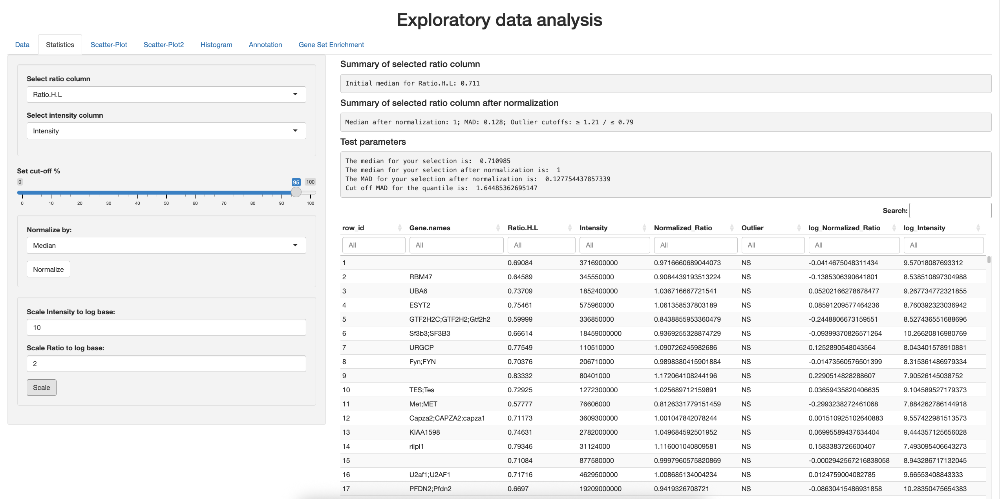
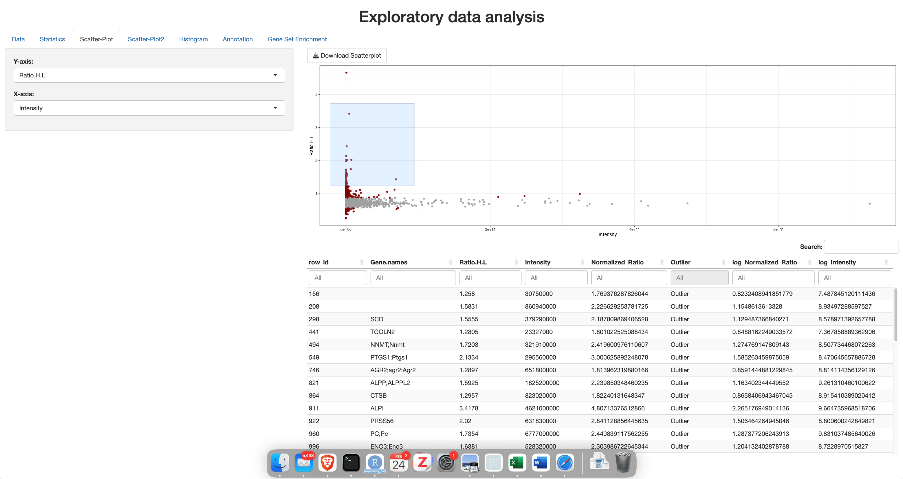
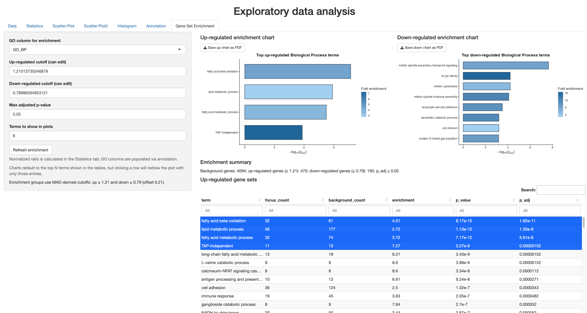

# Exploratory Data Analysis for SILAC experiments (Shiny)

This project is a Shiny app for quickly exploring quantitative proteomics tables.

It's workflow follows: upload one or more files, clean/filter columns, run basic ratio normalization, inspect outliers, make quick plots, and add GO annotations from mygene.

## What it does

- Uploads `.csv`, `.tsv`, or `.txt` files (single or multiple)
- Validates that uploaded files share the same column schema before combining
- Adds source tracking columns (`source_file`, `source_row_id`, `row_id`)
- Drops fully empty columns and converts data types automatically where possible
- Lets you select visible columns and filter out rows containing a given text pattern
- Provides ratio/intensity summary stats, normalization (mean or median), MAD-based outlier calls, and log transforms
- Includes scatter plots (ggplot and plotly), histogram, and PDF export for plots
- Supports simple gene-name extraction and GO annotation lookup (`mygene`) for Human or Mouse
- Exports the current table view as CSV or TSV

## Project structure

- `app.R`: complete Shiny app (UI + server)
- `Book1.txt`: example data file in this repo

## Requirements

- R (4.1+ recommended)
- R packages:
  - `shiny`
  - `DT`
  - `tidyverse`
  - `Cairo`
  - `ggplot2`
  - `gridExtra`
  - `shinythemes`
  - `plotly`
  - `mygene`

Install packages:

```r
install.packages(c(
  "shiny", "DT", "tidyverse", "Cairo", "ggplot2",
  "gridExtra", "shinythemes", "plotly", "mygene"
))
```

## Run the app

From the project directory:

```r
shiny::runApp("app.R")
```

Or in RStudio, open `app.R` and click **Run App**.

## Typical workflow

1. Go to the **Data** tab and upload one or more files.
2. Choose separator/header options if needed.
3. Keep only columns you care about and filter unwanted rows.
4. In **Statistics**, choose ratio/intensity columns, normalize, and flag outliers.
5. Use **Scatter-Plot** / **Scatter-Plot2** / **Histogram** for quick QC.
6. In **Annotation**, generate gene names, then add GO annotations.
7. Download the processed table from the **Data** tab.

## Notes

- Multi-file upload expects matching column names and order.
- GO annotation requires internet access to query mygene.
- For large files, annotation can take some time; progress is shown in the app.

## Screenshots

1. Data upload, filtering, and normalization summary along with the GSEA workflow.


2. Gene Set Enrichment tab showing the filtered tables and publication-ready plots.


3. Annotation tab with generated gene names and progress feedback.

